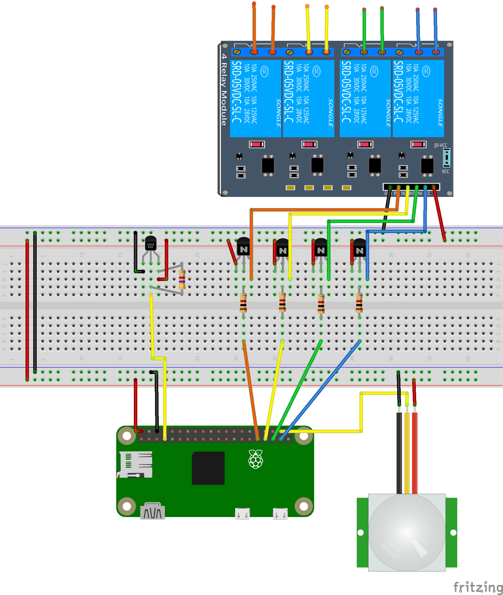

An open source, low-cost, Raspberry Pi powered, smart thermostat. Caves are generally cooler than nests.

Overview
=======
This program's goal is to maximize the amount of time spent in the comfort zone while minimizing the energy spent when the building is occupied.

Structure
========
This system is composed of a server, one or more thermostats, and optional nodes. Their purposes and interactions are as follows,

Server
-------
The server hosts the MySQL database and the web interface. Its purpose is to collect and analyze the sensor data from the thermostat(s) and any additional nodes, and use that information to direct the thermostat(s). In essence, the server is smart. The server can be a dedicated computer or it can run on the Raspberry Pi, alongside the thermostat program.

Thermostat
-------------
The thermostat measures temperature and directly interfaces with the wiring of the HVAC unit. It reports all measurements to the server and its actions are determined by the server. The thermostat is intended to be the Raspberry Pi.

Nodes
------
Nodes are optional pieces of hardware that provide additional sensor data to the MySQL database such as temperatures, humidity, and motion. Nodes might be of value in large spaces or in rooms isolated from the thermostat.

Nodes publish data using the MQTT protocol. This is done rather than modifying the MySQL database directly, simply because these nodes are small and rarely support SQL, as in the case of the ESP8266. The RPi subscribes to the MQTT channel and inserts the data it receives into the SQL database.

Installation
===========
clone the repository to the server and thermostat(s).
::
   git clone https://github.com/VectorSpaceHQ/Cave

Server
-------
Install mysql server on the server.
::
   sudo apt-get install mysql-server

Install supporting packages.
::
   sudo apt-get install python3-dev python3-pip python3-setuptools libmysqlclient-dev python3-mysql

Generate the initial MySQL database manually, then run ./src/database.py to create the tables
::
   mysql
   CREATE DATABASE hvac;
   ./src/database.py

You can confirm that the hvac database was added to your mysql server, by loging in at http://localhost/phpmyadmin/

Install required python packages.
::
   sudo pip3 install -r ./src/requirements.txt

Install Mosquitto on the server for MQTT brokering.
::
   sudo apt-get install mosquitto

Modify server/token.txt and server/server.conf files with appropriate values based on your wiring and preferences.

Thermostat
-----------
Install required python packages.
::
   sudo pip3 install -r ./thermostat/requirements.txt

Modify thermostat/token.txt and thermostat/thermostat.conf files with appropriate values based on your wiring and preferences.

Enable SPI and 1-Wire.
::
   sudo raspi-config
> Advanced Options > Enable SPI and 1-Wire

Services
copy cave_server.service to /etc/systemd/system/ on the server
copy cave_thermostat.service to /etc/systemd/system/ on the thermostat (RPi)

enable both of these services on their respective machines using
sudo systemctl enable cave_server.service
sudo systemctl enable cave_thermostat.service

Usage
=====
On the server,
::
   ./server/server.py start

On the RPi thermostat run,
::
   ./thermostat/thermostat.py start

MySQL database
=============
The database contains four tables.

ModuleInfo
-----------
This table contains an entry for each module (thermostat or node) connected to the system. It includes a unique ID, a description of the module's location, a firmware version, and boolean values to represent the presence of temperature, humidity, light, and motion sensors.

SensorData
-------------
This table logs all of the sensor readings, including the thermostat(s).

readingID, time, moduleID, location, temperature, humidity, light, sound, motion

ThermostatLog
-----------------
This table logs only the thermostat readings.

timeStamp, mode, moduleID, MinTemp, MaxTemp, actualTemp, coolOn, heatOn, fanOn, auxOn

ThermostatSet
----------------
This table provides the current directive for the thermostat(s). The server writes to this table and the thermostat reads from it.

timeStamp, moduleID, targetTemp, targetMode, expiryTime, entryNo

SystemLog
-----------
This table logs the state of the entire system.
timeStamp, Tthermostat, Toutside, Ttarget, Poccupancy

Testing
======
This software can be tested entirely on a single Raspberry Pi. Install the sample database found in /test, then run both the server.py and thermostat.py programs.
::
    mysql -uroot -p hvac < ./test/hvac_data.txt

    python3 -m unittest discover

Hardware
=======
Below is a wiring diagram for a Raspberry Pi zero with a temperature sensor, PIR sensor, and 4 channel relay.

** Standard thermostat pins
*** Honeywell TH6320U2008
pin spacing of 5mm (https://www.mouser.com/ProductDetail/845-30.359), 1.3mm diameter. two 8 pin columns separated by 44.4mm (1.75in)
*** Honeywell TH5320U1001
pin spacing of 5mm (https://www.mouser.com/ProductDetail/845-30.359), 1.3mm diameter. One 9 pin column.

HVAC 101
=======
The following HVAC information is coppied directly from, https://github.com/Willseph/RaspberryPiThermostat

HVAC 101

HVAC (heating, ventilating, and air conditioning) can be implemented in different ways within a house or apartment, and varies for different countries based on the wiring and such. I'm not an expert in HVAC systems, I pretty much just learned enough to get by for this project, but here's a pretty useful guide: https://lrak.net/wiki/Thermostat_signals_and_wiring.html

My particular apartment uses a heat pump, which uses the very same compressor action for the air conditioner. The only difference is the air flow. This makes it possible to, in my case, use four wires from the HVAC panel behind the original thermostat for this project:

R (Red): This is the "common" wire, meaning that a circuit is completed when any of the other wires are connected to this one, hence the relay module.
G (Green): This is the signal for the fan, which becomes activated when connected to R.
Y (Yellow): This is the signal for the compressor. By default, the air flow is set to blow heat into the apartment.
O (Orange): This is the signal to reverse the air flow from the compressor. With Y and O both active, the flow changes to blow cool air into the apartment.
I broke this down to a pretty simple formula while I started writing the software for the controller:

R + G = Fan
R + G + Y = Heater
R + G + Y + O = Air conditioner

It's also very important to note that the wires coming out of my HVAC use a low voltage at 24V, not mains power. With a relay module completing the circuits, it should still work with mains electricity, but it is very dangerous and you should NOT mess with mains power unless you know exactly what you're doing! An accident involving high voltage and current can very easily kill you.

If your home HVAC does not use a compressor heat pump or for another reason you cannot use the same setup I'm using, you will have to do some research and potentially adjust the hvaccontroller.py script accordingly.
